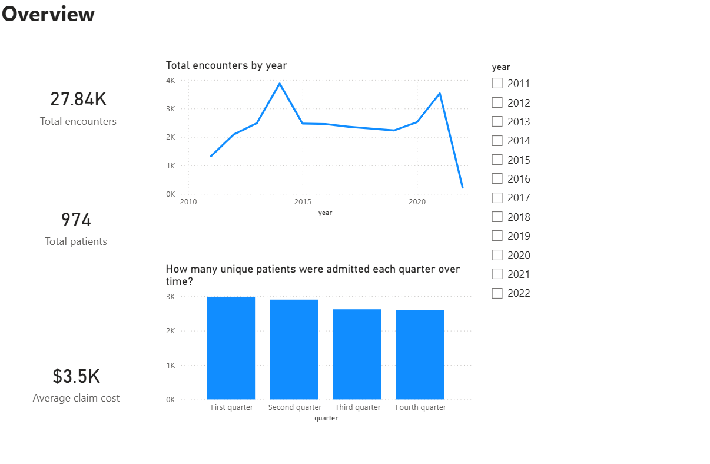
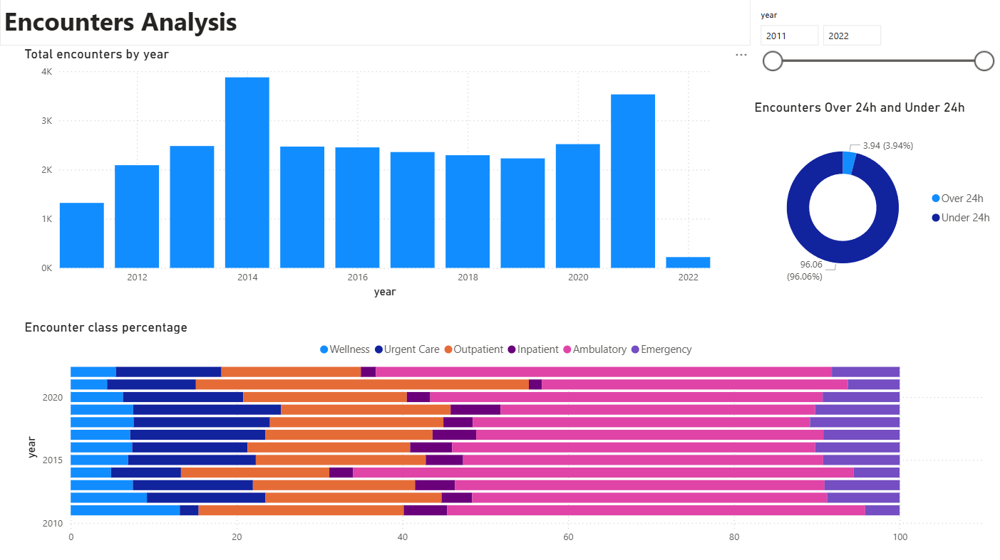
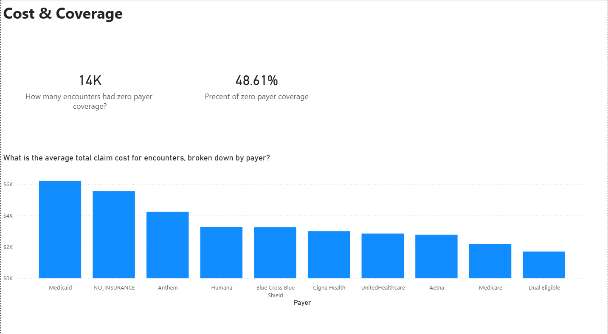
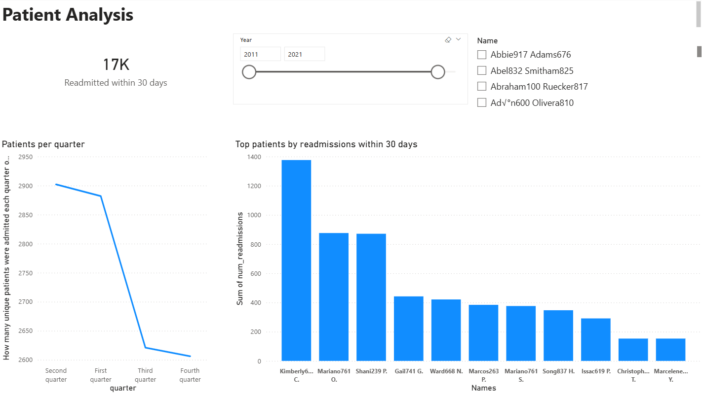

# Hospital Data Analytics with SQL & Power BI

## Project Overview
This project analyzes hospital data using **SQL** and visualizes insights in **Power BI**. The main goals are:

1. **Encounters Overview** – total encounters per year, encounter duration, and encounter class distribution.  
2. **Cost & Coverage Insights** – top procedures, average claim cost per payer, and zero payer coverage.  
3. **Patient Behavior Analysis** – patients admitted per quarter, readmissions within 30 days, and top readmitted patients.

---

## SQL Views
- **Staging views** – clean and prepare raw tables.  
- **Mart views** – business-ready tables for Power BI, including:  
  - `mart_encounters_per_year` – total encounters per year.  
  - `mart_encounter_class_percentage` – encounter distribution by class.  
  - `mart_encounter_duration_percentage` – % encounters over/under 24 hours.  
  - `mart_zero_payer_coverage` – zero payer coverage count and %.
  - `mart_top_procedures` – top 10 procedures with average cost.  
  - `mart_avg_claim_cost_by_payer` – average total claim cost by payer.  
  - `mart_patients_per_quarter` – unique patients per quarter.  
  - `mart_readmissions_per_patient` – patients readmitted within 30 days.  
  - `mart_top_readmitted_patients` – top 10 patients with most readmissions.  

---

## Power BI Dashboard
The dashboard has **four main pages**:

1. **Overview**  
   - Total encounters, total patients,Average claim cost,total encounters by year.
   -Slicer:Year;  
   

2. **Encounter Classes**  
   - total encounters by year 
   - encounter class percentage 
   - % of encounters over 24h and under 24h
   - Slicer: Year.  
     

3. **Costs & Coverage**  
   - Top 10 procedures table with average cost.  
   - How many encounters had zero payer coverage
   - Precent of zero payer coverage
   
    

4. **Patient Behavior**  
   - number of readmitted patients within 30 days
   - top readmitted patients within 30 days.  
   - Patitens  per quarter
   - Slicer: Name
     

---
